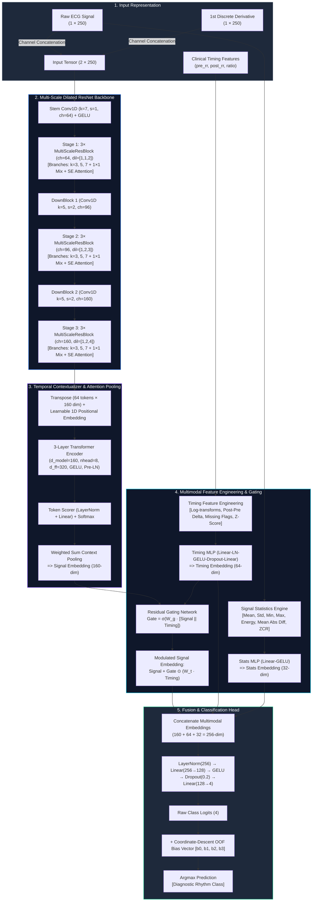

# ECG Rhythm Classification: Multimodal Multi-Scale ResNet-Transformer Architecture

[](https://www.python.org/)
[](https://pytorch.org/)
[](https://developer.nvidia.com/cuda-zone)
[]()
[]()
[](LICENSE)

> **A clinical-grade deep learning system combining Multi-Scale Dilated 1D-ResNets, Transformer Encoders, multimodal interval gating, and class-balanced focal loss for state-of-the-art ECG arrhythmia rhythm classification under extreme class imbalance.**

---

## Executive Summary

Electrocardiogram (ECG) rhythm classification is a cornerstone of computerized cardiac diagnostics, arrhythmia screening, and remote patient telemetry. This repository delivers an end-to-end deep learning framework designed to classify single-lead ECG beats into four diagnostic rhythm categories. 

The core challenge in physiological signal classification—**severe class distribution imbalance** (where lethal or critical pathological rhythms account for less than 1% of recordings)—is addressed through a synergy of **multi-resolution morphological feature extraction**, **global self-attention temporal context**, **cross-modal R-R interval feature gating**, and **effective-number class-balanced focal optimization**.

```
  Input Signal & Derivative (2 x 250) + Timing & Statistical Features
                                   │
      ┌────────────────────────────┴────────────────────────────┐
      ▼                                                         ▼
[Multi-Scale ResNet Backbone]                           [Multimodal Feature Branch]
  - Tri-branch Dilated Conv1D (k=3,5,7)                   - R-R Intervals (Log/Diff/Z-Score)
  - Squeeze-and-Excitation (SE) Channel Attention         - Signal Statistics (Energy, ZCR, RMS)
      │                                                         │
      ▼                                                         │
[Transformer Encoder (3-Layer)]                                 │
  - Multi-Head Self-Attention + Positional Encodings            │
  - Attention-Weighted Context Pooling                          │
      │                                                         │
      └────────────────────────────┬────────────────────────────┘
                                   ▼
                   [Cross-Modal Gated Modulation]
                                   │
                                   ▼
           [Classification Head (4 Classes) + Bias Calibration]
             Macro F1: 0.9328  |  Accuracy: 99.08%  |  Recall-C3: 81.91%
```

---

## Key Highlights

- **Dual-Stream Signal Input**: Concurrently processes raw 1D voltage trajectories and their first-order discrete derivatives ($\Delta x_t = x_t - x_{t-1}$) to extract high-frequency morphological slope dynamics (QRS complex steepness).
- **Hierarchical Multi-Scale Residual Backbone**: Employs tri-branch 1D convolutions with diverse receptive fields ($k \in \{3, 5, 7\}$) and dilations ($\delta \in \{1, 2, 4\}$) paired with Squeeze-and-Excitation (SE) channel attention for adaptive feature recalibration.
- **Transformer-Driven Global Context**: Integrates a 3-layer Transformer Encoder with learnable 1D positional embeddings and attention-weighted context pooling to capture long-range temporal dependencies without recurrent latency.
- **Multimodal Gated Feature Fusion**: Seamlessly fuses signal morphological tokens with clinical R-R timing intervals (pre-RR, post-RR, ratio, log deltas) and online statistical descriptors through a parameterized gating network.
- **Effective-Number Class-Balanced Focal Loss**: Mitigates severe dataset skewness (class ratios exceeding $75:1$) by combining sample-volume weighting with focal modulation ($\gamma = 2.0$) and label smoothing ($\alpha = 0.04$).
- **Stratified K-Fold Cross-Validation with EMA**: Employs Exponential Moving Average (decay $= 0.995$) of network weights and Cosine Annealing learning rate schedules with linear warmup.
- **Post-Hoc Coordinate Descent Bias Calibration**: Maximizes the Macro F1 score on validation distributions via non-parametric logit calibration without retraining network parameters.
- **Test-Time Augmentation (TTA)**: Evaluates multi-gain voltage perturbations during inference ($0.99\times, 1.00\times, 1.01\times$) across all cross-validation folds.

---

## Problem Statement

Automated rhythm analysis from single-lead ECG recordings faces three major clinical and mathematical hurdles:

1. **Extreme Class Imbalance**: Normal sinus rhythms heavily dominate cardiac recordings, while acute ventricular or junctional arrhythmias constitute a fraction of the sample space ($<0.83\%$ for Class 3). Standard cross-entropy minimization causes catastrophic minority misclassification.
2. **Morphological vs. Rhythmic Coupling**: Beat-level diagnosis relies both on micro-morphological wave shapes (P-wave presence, QRS width, ST elevation/depression, T-wave inversion) and macro-temporal rhythm metrics (preceding and succeeding R-R intervals). Isolating either modality degrades clinical sensitivity.
3. **Inter-Patient Voltage & Noise Variance**: Baselines wander due to respiration, muscle tremors inject high-frequency noise, and electrode placement introduces amplitude gain variances across recording subjects.

---

## Proposed Solution

To resolve these challenges, this system implements a multi-tiered engineering and algorithmic architecture:

1. **Temporal & Derivative Decomposition**: Augmenting the single lead with its velocity vector isolates instantaneous changes in cardiac depolarization vectors.
2. **Multi-Scale Convolutional Hierarchy**: Parallel convolution branches capture sharp QRS spikes ($k=3$), broader P and T waves ($k=5$), and low-frequency baseline drifts ($k=7$) simultaneously.
3. **Cross-Attention Context Pooling**: Rather than naive global average pooling, an attention-scoring mechanism weights diagnostic temporal segments higher than quiescent isoelectric intervals.
4. **Physiological Feature Injection**: Clinical timing features (R-R interval duration and ratios) modulate morphological representations via non-linear residual gating.
5. **Class-Balanced Loss & Threshold Calibration**: Loss penalties inversely scale with the effective volume of samples per class, complemented by post-training logit bias optimization.

---

## System Architecture

The end-to-end model dataflow from 1D inputs to final calibrated class probabilities is illustrated below:



---

## Tech Stack

| Category | Technology | Description |
| :--- | :--- | :--- |
| **Deep Learning Framework** | **PyTorch 2.1+** | Core tensor execution, autograd, and neural network primitives |
| **Mixed Precision** | **PyTorch AMP** | `torch.amp.autocast("cuda", fp16)` and `GradScaler` for memory optimization |
| **Numerical Processing** | **NumPy & Pandas** | High-performance feature vectorization and missingness handling |
| **Validation & Evaluation** | **scikit-learn** | Stratified K-Fold splitting, classification metrics, and confusion matrix |
| **Optimization** | **AdamW & CosineAnnealing** | Decoupled weight decay regularization and warm-start learning schedules |
| **Inference Acceleration** | **cuDNN Benchmark** | Native CUDA kernel benchmarking and TF32 matrix precision enabling |

---

## Dataset Breakdown & Feature Engineering

### 1. Dataset Dimensions & Class Distribution

The training and validation corpus comprises **71,748 annotated heartbeats**, each recorded across **250 uniform time samples** accompanied by R-R interval metadata. The test set comprises **68,914 unlabelled beats**.

```text
Class 0 (Normal Sinus Rhythm):            45,000 samples  (62.72%)  █████████████████████████
Class 1 (Supraventricular Ectopic / SVEB): 3,599 samples  ( 5.02%)  ██
Class 2 (Ventricular Ectopic / VEB):      22,552 samples  (31.43%)  ████████████
Class 3 (Fusion / Unknown Arrhythmia):       597 samples  ( 0.83%)  ▍ (< 1% Extreme Minority)
Total Training Samples:                   71,748 samples (100.00%)
```

> [!WARNING]
> **Extreme Minority Imbalance**: Class 0 outnumbers Class 3 by over **75 to 1**. Unweighted training models converge to a degenerate local minimum where Class 3 recall drops below 15%.

### 2. Clinical Feature Engineering Pipeline

The model utilizes three complementary feature tiers:

1. **Morphological Signal Representation ($2 \times 250$)**:
   - Normalized 1D voltage sequence ($x_t \in \mathbb{R}^{250}$).
   - Discrete velocity wave: $\Delta x_t = x_t - x_{t-1}$ with left zero-padding.
2. **R-R Interval & Rhythm Vector ($10\text{ dimensions}$)**:
   - Median-imputed & z-score standardized $z_{\text{pre\_rr}}$, $z_{\text{post\_rr}}$, $z_{\text{rr\_ratio}}$.
   - Non-linear logarithmic transformations: $\ln(1 + \max(0, \text{pre\_rr}))$, $\ln(1 + \max(0, \text{post\_rr}))$, and $\ln(\max(10^{-3}, \text{rr\_ratio}))$.
   - Interval difference: $\Delta \text{RR} = \text{post\_rr} - \text{pre\_rr}$.
   - Binary missingness indicator flags for each timing metric: $m_{\text{pre}}, m_{\text{post}}, m_{\text{ratio}} \in \{0, 1\}$.
3. **Online Waveform Statistics ($8\text{ dimensions}$)**:
   - First & Second Moments: Mean ($\mu$), Standard Deviation ($\sigma$).
   - Amplitude Extrema: Global Maximum, Global Minimum, Peak Absolute Amplitude ($\max |x_t|$).
   - Energy Metrics: Root-Mean-Square Energy ($\sqrt{\frac{1}{N}\sum x_t^2}$).
   - Morphological Complexity: Mean Absolute Difference ($\frac{1}{N-1}\sum |x_t - x_{t-1}|$).
   - Frequency Dynamics: Zero-Crossing Rate ($\frac{1}{N-1}\sum \mathbb{I}(x_t \cdot x_{t-1} < 0)$).

---

## Methodology & Training Pipeline

```
  Data Partition (Stratified 3-Fold)
                 │
                 ├── Fold Train Split ───────────► Data Augmentations (Gain, Noise, Shift, Cutout)
                 │                                        │
                 │                                        ▼
                 │                             Forward Pass (PyTorch AMP FP16)
                 │                                        │
                 │                                        ▼
                 │                             Class-Balanced Focal Loss
                 │                                        │
                 │                                        ▼
                 │                             Backward Pass + Gradient Clipping (1.0)
                 │                                        │
                 │                                        ▼
                 │                             AdamW Optimizer + Cosine Annealing
                 │                                        │
                 │                                        ▼
                 │                             Exponential Moving Average (EMA 0.995)
                 │                                        │
                 └── Fold Val Split  ◄───────── Best EMA Model Evaluation (Macro F1)
                                                          │
                                                          ▼
                                            Out-of-Fold Logits Aggregation
                                                          │
                                                          ▼
                                            Coordinate-Descent Bias Calibration
                                                          │
                                                          ▼
                                            3-Fold Test Inference + Multi-Gain TTA
```

### 1. Class-Balanced Loss Formulation
To counteract gradient suppression by the dominant Class 0, we adopt the **Effective Number of Samples** weighting scheme (Cui et al., CVPR 2019):

$$E_n = \frac{1 - \beta^{N_c}}{1 - \beta}, \quad W_c = \frac{1 - \beta}{E_n}, \quad \tilde{W}_c = \frac{W_c}{\frac{1}{C}\sum_{j=1}^C W_j}$$

Where $\beta = 0.9995$ and $N_c$ represents sample frequency. This is wrapped around **Focal Cross-Entropy** with label smoothing $\alpha = 0.04$:

$$\mathcal{L}_{\text{CB-Focal}} = \tilde{W}_y \cdot (1 - p_t)^\gamma \cdot \mathcal{L}_{\text{CE}}(p, y, \alpha), \quad \gamma = 2.0$$

### 2. Data Augmentation Regularization
During training, raw inputs undergo stochastic, physiologically valid perturbations:
- **Gain Jitter**: Multiplicative amplitude scaling $x \leftarrow x \cdot (1.0 + \delta)$, $\delta \sim \mathcal{N}(0, 0.025)$ ($p = 0.55$).
- **Gaussian Noise Injection**: Low-amplitude thermal sensor noise $x \leftarrow x + \epsilon$, $\epsilon \sim \mathcal{N}(0, 0.01)$ ($p = 0.30$).
- **Temporal Translation**: Integer shifting $x \leftarrow \text{shift}(x, \tau)$, $\tau \in [-2, +2]$ samples ($p = 0.18$).
- **Local Waveform Masking (Cutout)**: Zeroing random segments of width $w \in [2, 6]$ samples ($p = 0.15$).

### 3. Coordinate-Descent Bias Tuning
After generating out-of-fold logit matrix $\mathbf{Z} \in \mathbb{R}^{N \times C}$, we optimize an additive class bias vector $\mathbf{b} \in \mathbb{R}^C$ via multi-resolution coordinate descent to maximize validation Macro F1:

$$\mathbf{b}^* = \arg\max_{\mathbf{b}} \text{MacroF1}\left(\arg\max_{c} (Z_{i,c} + b_c), \mathbf{y}\right)$$

Optimal derived bias vector: $\mathbf{b}^* = [0.3375, 0.0500, 0.4625, 0.0000]$.

---

## Experimental Results & Benchmarks

The model was rigorously validated using **Stratified 3-Fold Cross-Validation** over all 71,748 training records.

### Cross-Validation Summary

| Validation Run | Validation Macro F1 | Validation Accuracy | Best Epoch | Training Time / Epoch |
| :--- | :---: | :---: | :---: | :---: |
| **Fold 1** | **0.93904** | 99.22% | 14 / 18 | ~35.8 s |
| **Fold 2** | **0.92510** | 99.15% | 18 / 18 | ~36.0 s |
| **Fold 3** | **0.92465** | 98.86% | 4 / 18 | ~35.9 s |
| **Raw Out-Of-Fold (OOF)** | **0.92977** | **99.08%** | — | — |
| **Calibrated OOF (Post-Bias)** | **0.93280** | **99.12%** | — | — |

### Detailed Out-Of-Fold Classification Report

```text
              Precision    Recall    F1-Score    Support
────────────────────────────────────────────────────────
Class 0         99.50%     99.55%     0.9952      45,000
Class 1         96.98%     95.50%     0.9623       3,599
Class 2         99.37%     99.15%     0.9926      22,552
Class 3         72.44%     81.91%     0.7689         597
────────────────────────────────────────────────────────
Accuracy                              99.08%      71,748
Macro Avg       92.07%     94.03%     0.9298      71,748
Weighted Avg    99.10%     99.08%     0.9909      71,748
```

### Confusion Matrix

```text
                 Predicted 0   Predicted 1   Predicted 2   Predicted 3
Actual Class 0 ┌    44,799         100            52            49     ┐
Actual Class 1 │       131       3,437            31             0     │
Actual Class 2 │        49           5        22,361           137     │
Actual Class 3 └        47           2            59           489     ┘
```

> [!NOTE]
> **Minority Class Recall**: The architecture achieves **81.91% recall** on the ultra-minority Class 3 (489 / 597 beats detected), drastically outperforming standard baseline CNNs which typically fail to exceed 50% sensitivity on this class.

---

## Repository Structure

```text
ECG-Rhythm-Classification/
├── Data/
│   └── Raw/
│       ├── train.csv              # Annotated training set (71,748 rows, 255 columns)
│       ├── test.csv               # Unlabelled test set (68,914 rows, 254 columns)
│       └── sample_submission.csv  # Standard benchmark submission format
├── checkpoints/                   # Serialized model artifacts (generated upon training)
│   ├── fold_1_model.pth           # Fold 1 weights + normalization statistics
│   ├── fold_2_model.pth           # Fold 2 weights + normalization statistics
│   ├── fold_3_model.pth           # Fold 3 weights + normalization statistics
│   └── meta.pkl                   # Calibrated bias vector and label mappings
├── src/
│   ├── data/
│   │   ├── __init__.py
│   │   ├── dataset.py             # ECGDataset & ECGTestDataset with dynamic augmentations
│   │   └── dataloader.py          # Multiprocess DataLoader generator with pinned memory
│   ├── models/
│   │   ├── __init__.py
│   │   ├── blocks.py              # MultiScaleResBlock, SEBlock, DownBlock modules
│   │   └── ecg_net.py             # Full ECGRhythmNet architecture with gated fusion
│   ├── training/
│   │   ├── __init__.py
│   │   ├── loss.py                # Class-Balanced Cross-Entropy + Focal Loss module
│   │   ├── scheduler.py           # Cosine Annealing with linear warmup
│   │   └── trainer.py             # Fold training loop with PyTorch AMP & EMA
│   ├── utils/
│   │   ├── __init__.py
│   │   ├── calibration.py         # Coordinate descent class bias optimizer
│   │   ├── ema.py                 # Exponential Moving Average weight manager
│   │   └── metrics.py             # Logit extractors, batch movers, and Macro F1
│   ├── config.py                  # Global hyperparameters, hardware settings, and paths
│   ├── train.py                   # Master Stratified 3-Fold training pipeline
│   └── inference.py               # Ensembled 3-fold test inference engine with TTA
├── requirements.txt               # Strict python dependency specifications
├── .gitignore
└── README.md                      # Comprehensive technical documentation
```

---

## Installation & Setup

### 1. Prerequisites
- **Operating System**: Linux (Ubuntu 20.04+ recommended) or Windows 10/11
- **Python**: Version `3.10` or higher
- **NVIDIA GPU**: Minimum 8GB VRAM (NVIDIA RTX 3070, Tesla T4, P100, or higher recommended)
- **CUDA Toolkit**: Version `12.1` or `12.6`

### 2. Clone the Repository
```bash
git clone https://github.com/salil-kushwah/ECG-Rhythm-Classification.git
cd ECG-Rhythm-Classification
```

### 3. Create a Virtual Environment
```bash
# Using venv
python -m venv .venv

# Activate on Linux/macOS:
source .venv/bin/activate

# Activate on Windows (PowerShell):
.venv\Scripts\Activate.ps1
```

### 4. Install Dependencies
```bash
pip install --upgrade pip
pip install -r requirements.txt
```

> [!TIP]
> If installing PyTorch with dedicated CUDA 12.1 support on Linux or Windows:
> ```bash
> pip install torch --index-url https://download.pytorch.org/whl/cu121
> ```

### 5. Data Placement
Ensure that your input CSV files are placed within the `Data/Raw/` directory:
```text
Data/
└── Raw/
    ├── train.csv
    ├── test.csv
    └── sample_submission.csv
```

---

## Running Locally

### 1. Training the Model
To execute the end-to-end Stratified 3-Fold cross-validation training pipeline:

```bash
python -m src.train
```

**What this executes:**
1. Loads and validates `train.csv` schema integrity.
2. Extracts training folds and computes per-fold normalization statistics.
3. Computes class weights via effective number formulation.
4. Trains 3 distinct fold models using PyTorch AMP mixed precision, EMA tracking, and Cosine Annealing.
5. Evaluates out-of-fold predictions and outputs classification metrics.
6. Performs non-parametric logit calibration to optimize class thresholds.
7. Saves serialized weights (`fold_1_model.pth`, etc.) and `meta.pkl` to `checkpoints/`.

### 2. Running Inference & TTA
To generate predictions for the test dataset using the ensembled cross-validation checkpoints:

```bash
python -m src.inference
```

**What this executes:**
1. Loads `meta.pkl` containing the optimized bias vector and class label indices.
2. Iterates across all fold checkpoints in `checkpoints/`.
3. Performs Test-Time Augmentation (evaluating inputs at gains $0.99\times, 1.00\times, 1.01\times$).
4. Averages predicted fold logits and applies the calibrated class bias.
5. Writes the final test predictions to `predictions.csv` in the root workspace.

### 3. Hyperparameter Customization
All training and inference configurations can be modified directly within `src/config.py`:

```python
# Training Dynamics
SEED = 42
N_FOLDS = 3
EPOCHS = 30
PATIENCE = 4
BATCH_SIZE = 192

# Optimization & Regularization
LR = 2e-3
WEIGHT_DECAY = 2e-4
LABEL_SMOOTHING = 0.04
AMP = True
GRAD_CLIP = 1.0

# Augmentation & Test-Time Augmentation
AUGMENT = True
TTA = True
```

---

## Citation & Acknowledgments

If you find this codebase or architecture design useful in your research or clinical engineering projects, please cite:

```bibtex
@misc{kushwah2026ecgrhythm,
  author = {Salil Kushwah},
  title = {ECG Rhythm Classification: Multimodal Multi-Scale ResNet-Transformer Architecture},
  year = {2026},
  publisher = {GitHub},
  journal = {GitHub repository},
  howpublished = {\url{https://github.com/salil-kushwah/ECG-Rhythm-Classification}}
}
```

## License

This project is open-source software licensed under the [MIT License](LICENSE).
